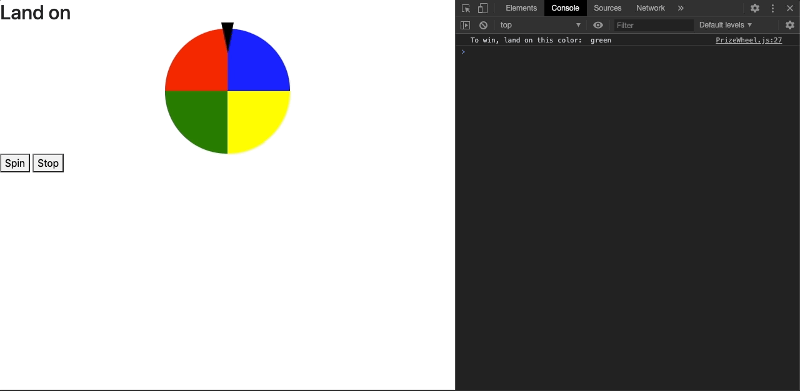

# prize-wheel-app

This is a prize wheel created with Vanilla JS by using some object oriented classes and utilizing the Pub/Sub design pattern. This is a test component I created to use in a future project to deliver prizes to users.
